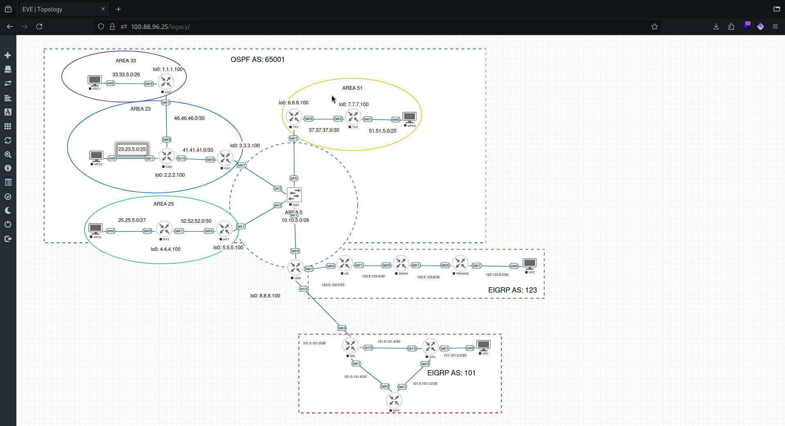
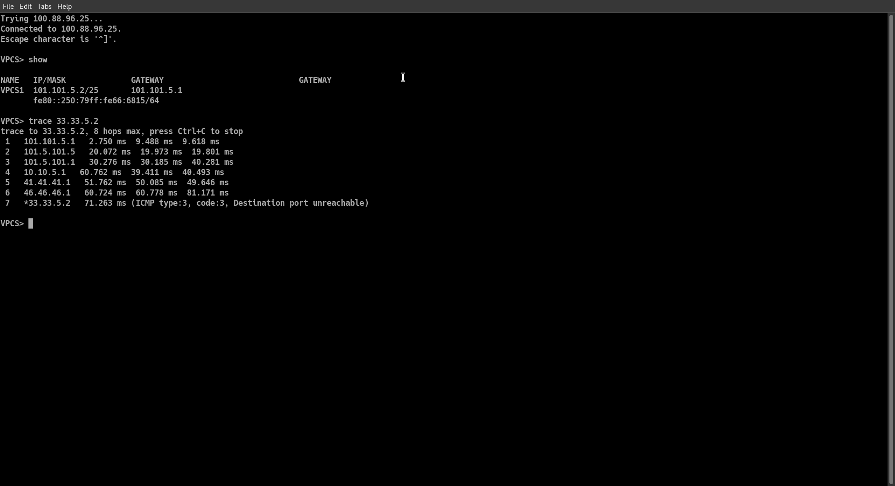
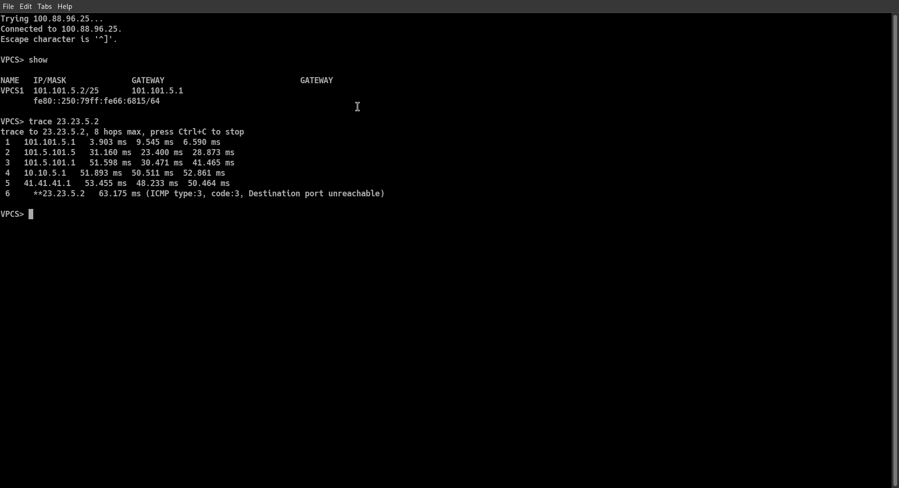
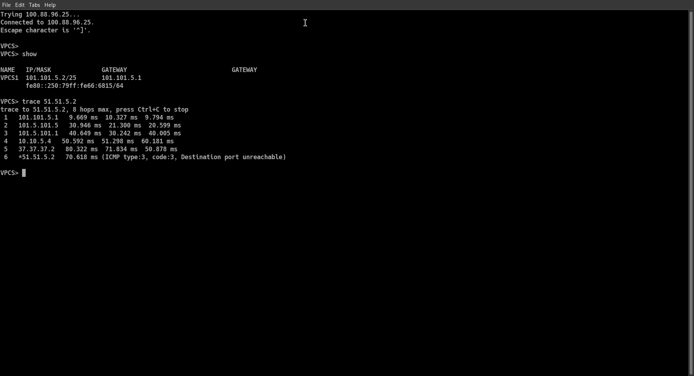
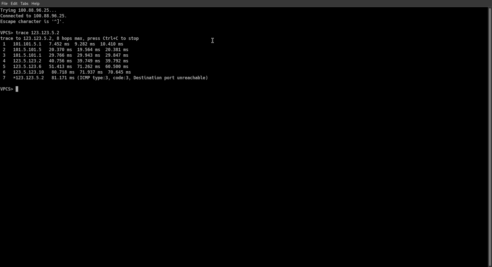
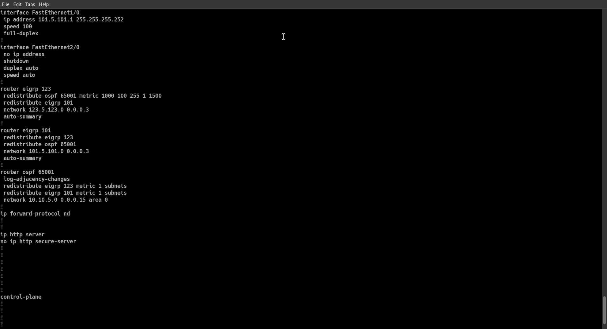
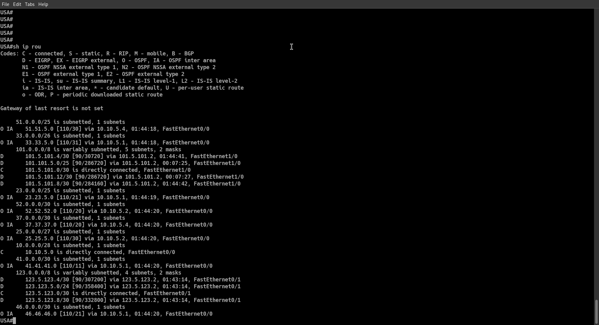
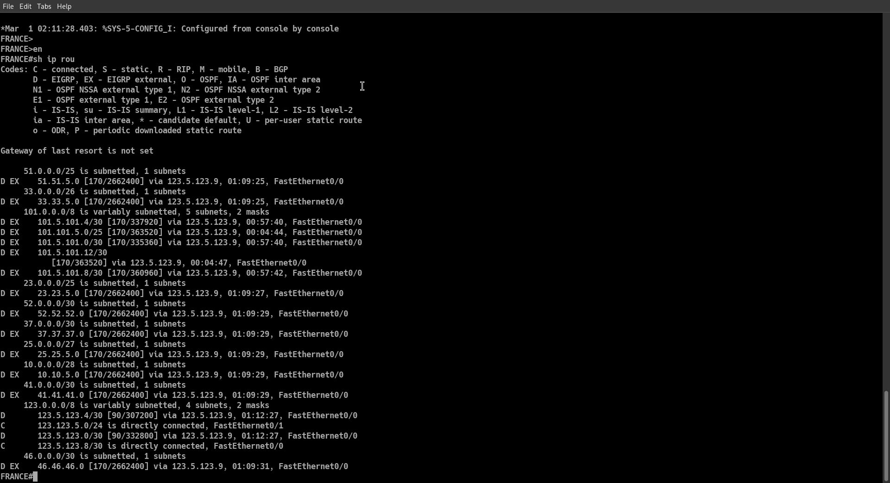
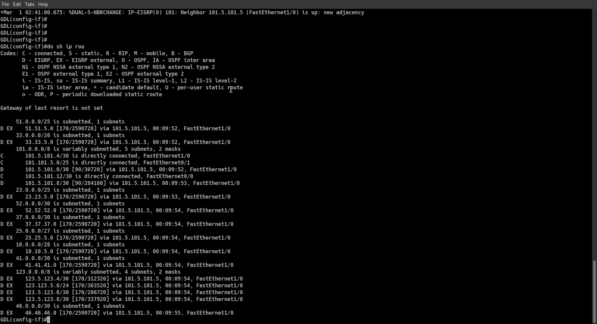
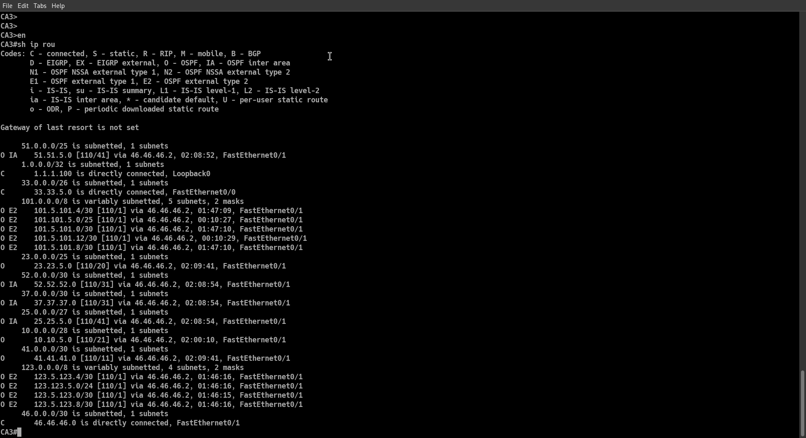

# Contextualization

Nowadays the existence of different interconnected WANs require a strong but simple level of organization to become scalable, unique, maintainable and aquire autonomy. The way the previous is achieved is by the use of an *Autonomous System Number*, which is a set of IP networks that operate under a single administrative entity (e.g. ISPs networks). The need of interconnecting AS will be covered in further sections where the main objective is to demonstrate how AS using different routing protocols are redistributed in such a way they know each other's networks and achieve multiple WANs interconnected.

## Network Topology



## Objectives

- Interconnect three different autonomous systems.
- Configure the OSPF and EIGRP AS.
- Redistribute EIGRP and OSPF protocols among all the AS.

# Methodology

**NOTE:** This technical report does not cover the configuration of the OSPF AS

## EIGRP Configuration for 101 and 123 AS

**Asuming all network devices have already been configure with an ip address and their respective interfaces are turned on:**

- Configure EIGRP in all routers including the ASBR:

```bash
router eigrp {ASN}
network {IPv4} {WildCard} # repeat for each network directly connected to the router
no auto
```


Even if summarization seems viable for both AS, consider there are networks that will not fit in the summarized network, therefore, summarization might not work.

- For the ASBR (USA router), configure both AS and add it to the OSPF AS by performing the following command:

```bash
router ospf {ASN}
network {IPv4} {WildCard} area 0
```

## AS Redistribution

The redistribution process will happen on the ASBR, since the gateway is directly connected to all three AS sections, thus participates in the three routing processes, it has the hability to redistribute networks to each AS.

In this case, the AS 123 and 101 need to know each other as well as they need to know ospf networks, and ospf networks need to know both EIGRP AS, we can achieve this by entering the following commands on the ASBR:

- Redistribute EIGRP and OSPF AS into another EIGRP AS

```bash
router eigrp {AS}
redistribute eigrp {AS_to_redistribute} 
redistribute ospf {AS_to_redistribute} metric {Bandwidth} {Delay} {Reliability} {Load} {MTU}
```

You would redistribute the 123 and 65001 AS in the 101 as follows:

```bash
router eigrp 101
redistribute eigrp 123
redistribute ospf 65001
```

The arguments of the **metric** parameter in the OSPF redistribution command can be automatically asigned by the router.

- Redistribute EIGRP AS into a OSPF AS

```bash
router ospf {AS}
redistribute eigrp {AS_to_redistribute} metric 1 subnets
```

The **subnets** parameter will indicate to redistribute all subnets instead of just classful networks


# PoC

## Trace Command from the 101 AS VPC to all VPCs










## ASBR (USA) configuration and routing table





## France, GDL and Ca3 routing tables







# Team Findings and Member's conclusions

**Rios Gomez Jose Enrique** In conclusion, the practice was very cool in combination with the ospf practice because we are already creating much bigger networks than in the last semester and there are more requirements, but also on the other hand it becomes a little complicated if you didn't understand something because in the internet is a little complicated to find the solution to that doubt.

**Juarez Mota Daniel Alejandro:** Trough the practice I reviewed the concept of redistribution studied during Introducion to Networks in first semester. I learned what redistribution is, how it works and why it is necessary. I also learned about the ASN and its importance in the real world, I recapitulated about summarization as well when configuring routing procesess as I was not understanding at all why no auto summarization could be benefical in the majority of scenarios. I did not present any complications related to the configuration and reporting process, however our team experimented some with our EVE-NG instance as it removed all configurations with no advertisement (even if we saved the configurations in the running config file). 
