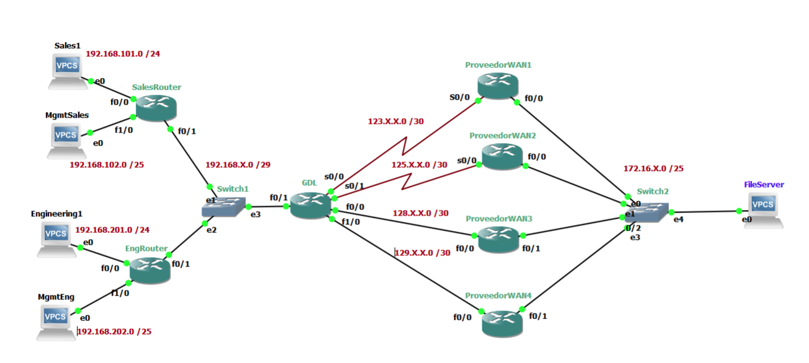
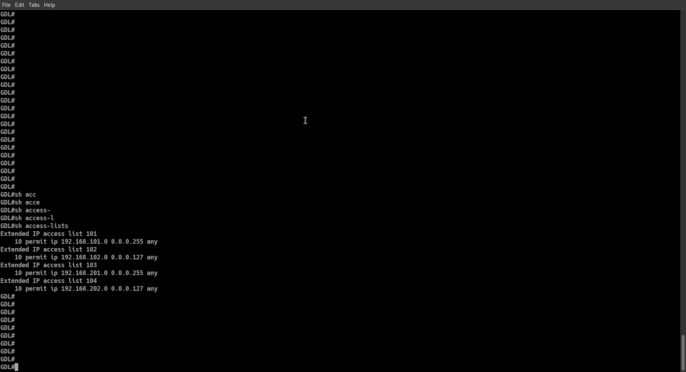
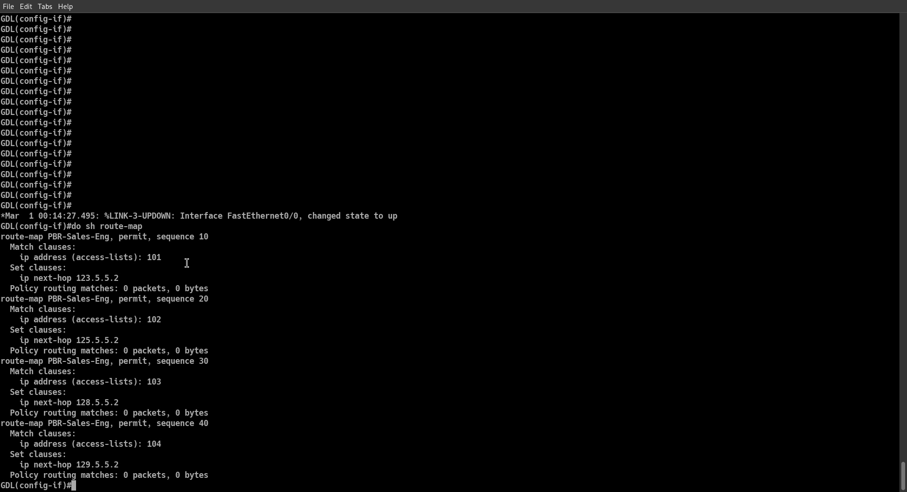
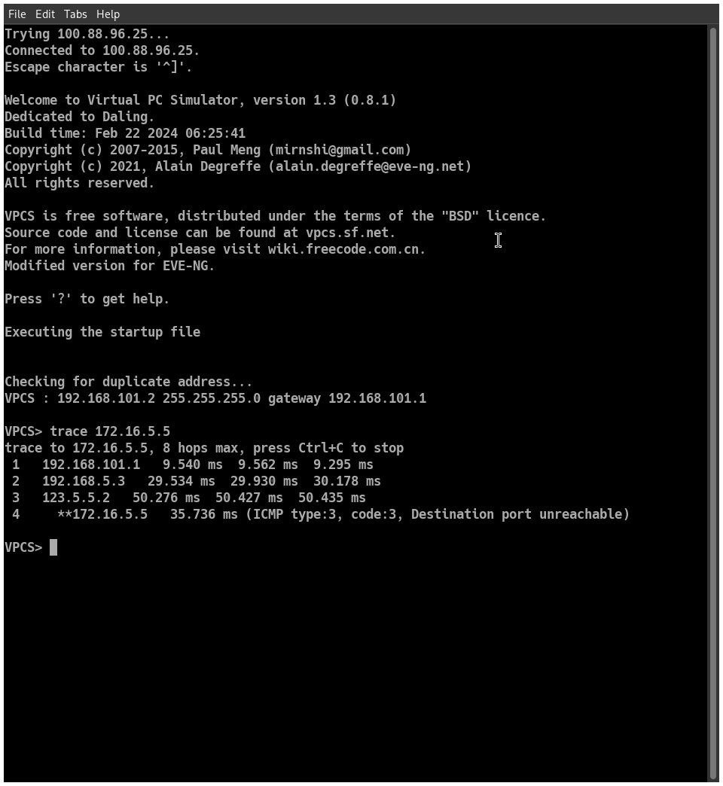
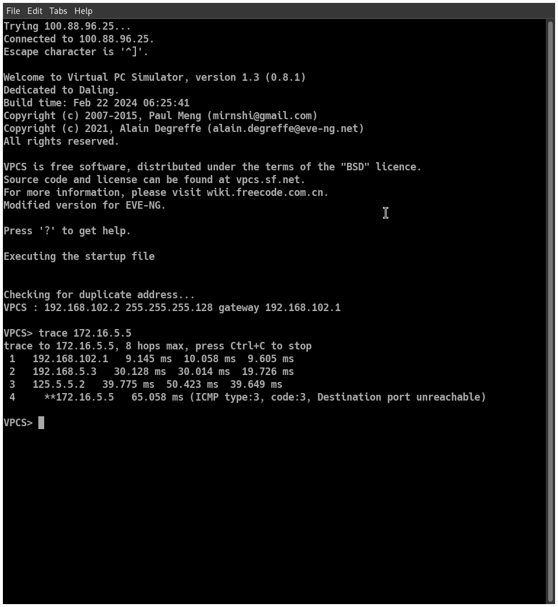

# Contextualization

**Policy Based Routing** is defined as a series of prewritten rules on a router in a way that overrides its routing table to satisfy the routing rules defined on a policy. PBR rules set packets to a route map based on the packet's metadata, rules can be applied to certain protocol, port or address, then based on a policy, the packet will be sent trough a certain route overriding the routing table.

This report covers the configuration steps and implementation of Policy Based Routing. It is assumed there is an IPv4 WAN already configured working with the EIGRP routing protocol. The topology where PBR concepts will be applied ilustrates that there are two departments connected to Guadalajara's gateway, where this router is directly connected to 4 WAN providers. The objective is to redirect each departament's traffic to its corresponding WAN provider.

## Network Topology




## Objectives

- To configure and apply policy based routing.
- Redirect traffic for each department trough its corresponding WAN provider.


# Methodology

The selection of the router that will redirect network traffic must be done based on the objective, in this case, certain traffic must be redirected to a certain WAN route, the only router with such capability within the topology is GDL's router, since it is directly connected to all WAN providers.

To configure a PBR on a cisco router, it is required to set up access lists to target traffic of interest, then create a route map that will be configured to redirect to a certain hop all traffic that maches the access lists' criteria[1].

- Create an access list (or a set of them):
  
```bash
access-list {id} permit ip {ipv4} any
```

In the topology's case on GDL router:

```bash
access-list 101 permit ip 192.168.101.0 0.0.0.255 any
access-list 102 permit ip 192.168.102.0 0.0.0.127 any
access-list 103 permit ip 192.168.201.0 0.0.0.255 any
access-list 104 permit ip 192.168.202.0 0.0.0.127 any
```

- Set up a route map and name it:

```bash
route-map {name}
```

- The router's CLI will change its mode, match a certain access list and set a hop to send the target traffic:

```bash
match ip address {access-list id}
set ip next-hop {next gateway}
```

A cisco router only supports one route map per port, so it is needed to set up a single route map with different rules, the router will automatically detect that route maps are different

```bash
route-map PBR-Sales-Eng 
match ip address 101
set ip next-hop 123.5.5.2

route-map PBR-Sales-Eng 
match ip address 102
set ip next-hop 125.5.5.2

route-map PBR-Sales-Eng 
match ip address 103
set ip next-hop 128.5.5.2

route-map PBR-Sales-Eng 
match ip address 104
set ip next-hop 129.5.5.2
```

- Apply the created policies to the desired interfaces:

```bash
in {interface}
ip policy route-map {policy name}
```

Applied to our case:

```bash
ip policy route-map PBR-Sales-Eng
```

# PoC

## Access lists 



## Route maps



## Trace from each pc to the file server






# Team Findings and Member's conclusions

**Juarez Mota Daniel Alejandro:** Policy Based Routing was not only a difficult concept to learn but also to apply, given its simplicity, yet it was necessary in the real world. One of the applications I found is the smart selection of traffic. It could, for instance, be applied in a VPN scenario where certain traffic must be encrypted, but for some other type, encryption might not be required. I did not have complications with theoretical concepts or with their implementation, given that PBR is also intuitive.

**Jose Enrique Rios Gomez:** Policy-Based Routing is not a particularly complex topic, but it was challenging to apply. Even though I knew the commands and the theory, I struggled with where to implement them. I initially thought that the PBR commands should be applied near the VPCs, but I was mistaken. Instead, they needed to be applied closer to the providers, as PBR redirects packets based on route maps.

# References

[1] 

“Policy-Based Routing (PBR) Explained,” CBT Nuggets. https://www.cbtnuggets.com/blog/technology/networking/policy-based-routing-pbr-explained

‌
